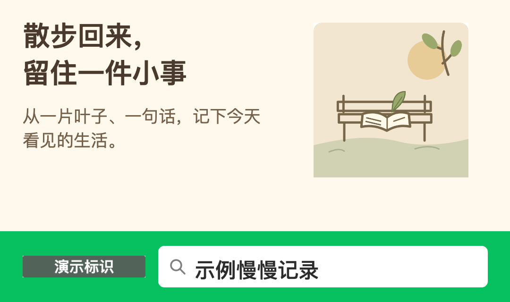
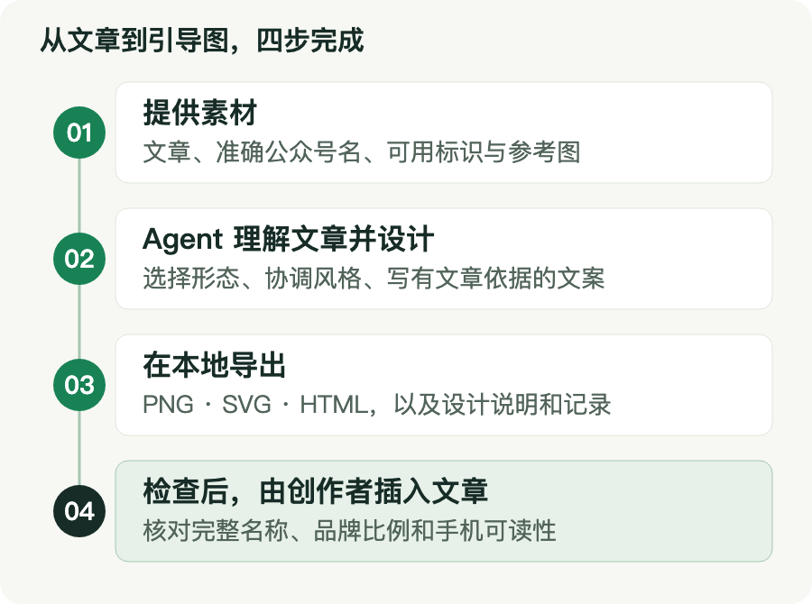

# 微信文章搜一搜物料设计


**给 Agent 一篇文章和准确的公众号名称，生成一张适合放进文章的搜一搜引导图。**

`wechat-search-designer` 让 Agent 负责读文章、选形态、写文案，本地工具负责排版和导出。输出 PNG、可编辑 SVG、HTML 预览及设计说明，适用于支持本地 Agent Skills 的创作环境。

[查看示例](#示例) · [安装与第一次运行](#安装与第一次运行) · [设计输入格式](references/design-input.md) · [报告问题](https://github.com/Yuangx/wechat-search-designer/issues)

> 当前为 `0.2.0-rc.1` 发布候选。公开包包含原创排版组件与虚构示例；真实设计需要使用者提供可用的搜一搜标识。第三方 PDF、AI、字体和品牌图片不随仓库分发。代码许可证尚待维护者确认，当前不宣称已取得开源授权。

## 你会拿到什么

| 形态 | 适合的文章 | 调整方式 |
| --- | --- | --- |
| 简洁搜索条 | 配图丰富、已有作者卡的文章 | 一句主题提示，加完整公众号名 |
| 文末引导卡 | 需要承接核心价值的教程或观点文章 | 标题、原文有依据的价值文案、文章配色 |
| 主题场景卡 | 有可用于成品的照片或插画 | 保留主题画面，调整文案和布局 |

默认交付一款，并说明插入位置。公众号名称逐字保留；长名称会切换布局和增加高度。收益描述须有原文依据。原文章由创作者决定何时插入图片。

## 示例

以下是完全虚构的文章与账号，图片中的「演示标识」是原创占位图，**不是微信品牌标识**。

**工具教程 → 简洁搜索条**：正文已有操作截图，用一句话承接文章。


**观点文章 → 文末引导卡**：用原文中的核心观点衔接搜索行为。


**生活随笔 → 主题场景卡**：用画面和文案延续文章的生活气息。



查看 [示例原文与输入](examples/README.md)，或运行下文的本地演示重新生成。

## 如何完成一张图



提供文章、准确公众号名和可用标识 → Agent 设计 → 本地导出 → 检查后插入。参考图可选；已有文章和素材可以直接复用。

顶部介绍图是 AI 生成的项目概念插画；上面的三类成品由实际导出工具生成。流程图另附[可编辑 SVG](docs/images/workflow.svg)。图片来源与维护方式见[视觉素材说明](docs/visual-assets.md)。

## 安装与第一次运行

### 1. 放入 Agent 的技能目录

在 [GitHub 仓库](https://github.com/Yuangx/wechat-search-designer)选择 **Code → Download ZIP**。解压后将包含 `SKILL.md` 的文件夹命名为 `wechat-search-designer`，保留全部子目录，再放入你的 Agent 支持的本地 Skill 目录。后续如有独立版本安装包，可从仓库 Releases 下载。

安装目录由宿主决定。本仓库不会自动修改全局配置；`agents/openai.yaml` 提供可选的 Codex 展示信息，其他宿主读取通用的 `SKILL.md` 即可。确认宿主已发现该 Skill 后再调用。

### 2. 准备本地导出环境

需要 Node.js 22 或更高版本、可用的中文字体，以及能够查看图片和运行本地命令的 Agent。首次准备依赖需要联网：

```bash
npm ci
npx playwright install chromium
node scripts/design.mjs doctor
```

Linux 如缺少浏览器系统库，可按 Playwright 提示安装系统依赖。中文字体可使用系统自带字体或已合法安装的 Noto Sans CJK。导出记录会保存实际使用的字体。

无需 Illustrator、Figma、Canva、外部模型 API Key 或生图账号。安装完成后，普通导出在本地进行，渲染页面的外部网络请求会被阻止。宿主 Agent 如何处理文章取决于宿主本身，本工具不会替代其隐私设置。

### 3. 先试一个不需要微信素材的演示

```bash
npm run demo -- outputs/first-demo
```

打开输出目录中的 `index.html`。演示使用随包原创占位标识，状态为 `demo_exported`，用来了解选型与导出效果，不能当作正式微信物料发布。

### 4. 设计自己的文章

准备准确公众号名和有相应使用依据的搜一搜 PNG 标识。浅色内容区使用反白标识，深色内容区使用正色标识。保留原横版比例 592:105，工具不会自行绘制或仿造官方标识。

对 Agent 说：

> 使用 $wechat-search-designer，根据这篇文章设计一张搜一搜引导图。公众号名称是「示例创作室」。请沿用文章配色；使用我提供的搜一搜标识，放在文末。

Agent 会阅读文章、查看参考图，并按 [设计输入说明](references/design-input.md)写出 JSON。你的标识和文章可以放在仓库外；如放在仓库内，使用已忽略的 `local-assets/`、`inputs/` 目录保存。

```bash
node scripts/design.mjs render inputs/design.json outputs/article-v1
```

所有输入相对路径以设计 JSON 所在目录为基准；包内组件相对工具自身定位。输出目录非空时会拒绝覆盖，请使用新版本目录。

## 输出与完成状态

| 文件 | 用途 |
| --- | --- |
| `material.png` | 插入文章的图片 |
| `material.svg` | 可编辑文字与形状，图片嵌入其中 |
| `mobile-preview.png` | 375 px 宽检查图 |
| `preview.html` | 本地预览与下载入口 |
| `design-notes.md` | 选型、文案依据和建议位置 |
| `manifest.json` | 输入指纹、素材来源、字体、尺寸、检查与产物校验值 |

`exported` 只表示导出和自动检查通过。Agent 还需实际打开图片与预览、核对名称和手机可读性，然后记录视觉审阅，才可报告 `completed`。`demo_exported` 始终只是演示。图片本身不能点击发起微信搜索。

## 常见问题

**没有准确公众号名？** Agent 会补问，不能用署名、文章标题或产品名替代。

**没有品牌标识？** 可先跑演示。真实设计返回 `BRAND_REQUIRED`，提供本地标识后继续。

**PNG 没有导出？** 查看 `manifest.json` 中的 `export_error`。损坏图片会返回 `IMAGE_DECODE`；浏览器不可用时也不会把源文件说成 PNG。可先生成源文件：

```bash
node scripts/design.mjs render inputs/design.json outputs/source-v1 --source-only
```

**另一台机器的 SVG 字体变化了？** SVG 会使用新机器上的字体；PNG 保持导出时的效果。发布前以实际图片检查为准。

**已有 Playwright 或 Chromium？** 可通过 `WECHAT_SEARCH_PLAYWRIGHT_MODULE`、`WECHAT_SEARCH_BROWSER` 指定宿主已有环境。它们是可选设置，不需要写进设计记录或仓库。

## 开发与反馈

```bash
npm run check
npm test
npm run package
```

打包额外需要 Python 3.9+，只使用标准库。包由 `distribution-files.json` 明确列出的文件生成，测试输出、真实文章、本地标识和依赖目录不会自动进入 ZIP。

问题复现请用虚构文章、虚构账号与无隐私截图。功能建议和一般故障可在本仓库 Issues 提出；安全问题见 [SECURITY.md](SECURITY.md)。贡献方式见 [CONTRIBUTING.md](CONTRIBUTING.md)，相处规则见 [CODE_OF_CONDUCT.md](CODE_OF_CONDUCT.md)。

## 范围、来源与许可

首版覆盖文章内静态物料，不自动发布微信文章或处理视频落版。布局参考 2021-11-25 版搜一搜设计关系，属于文章内创作适配，不是微信官方工具或当前广告投放认证。

代码许可证当前待确认；第三方标识、用户图片、商标和字体各自遵循其使用条件，不会因本仓库的代码许可证而自动获得授权。详见 [NOTICE.md](NOTICE.md)。维护者发布步骤与验证边界见 [发布说明](docs/releasing.md)。
